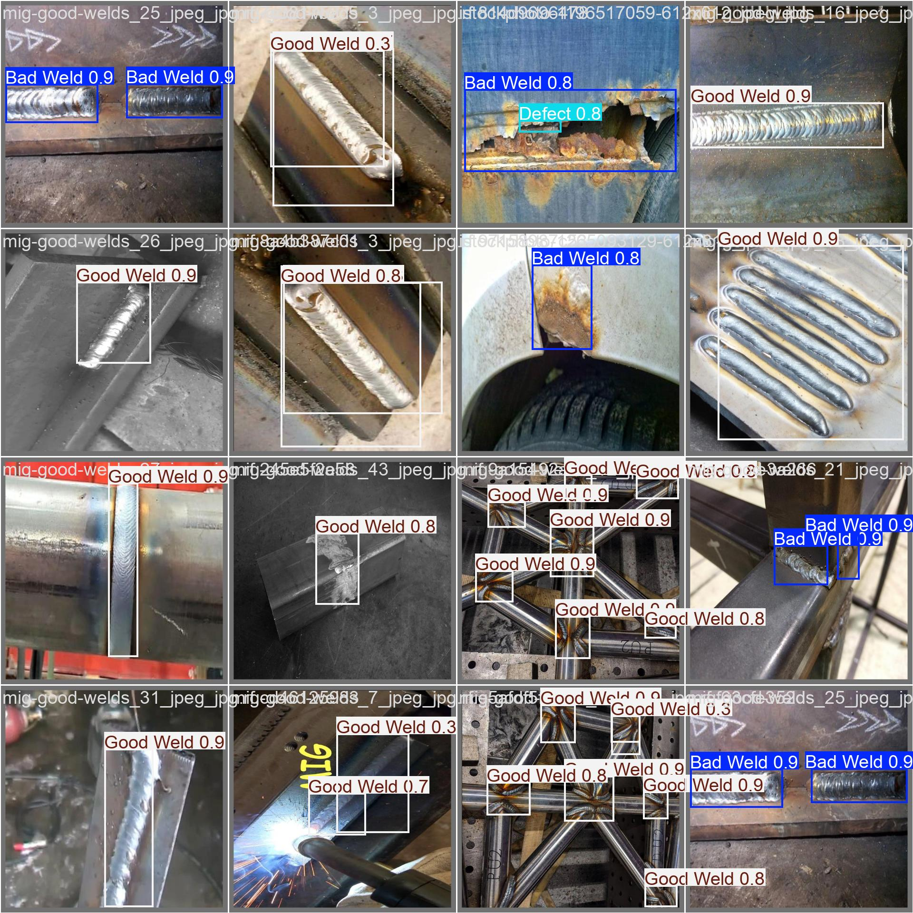
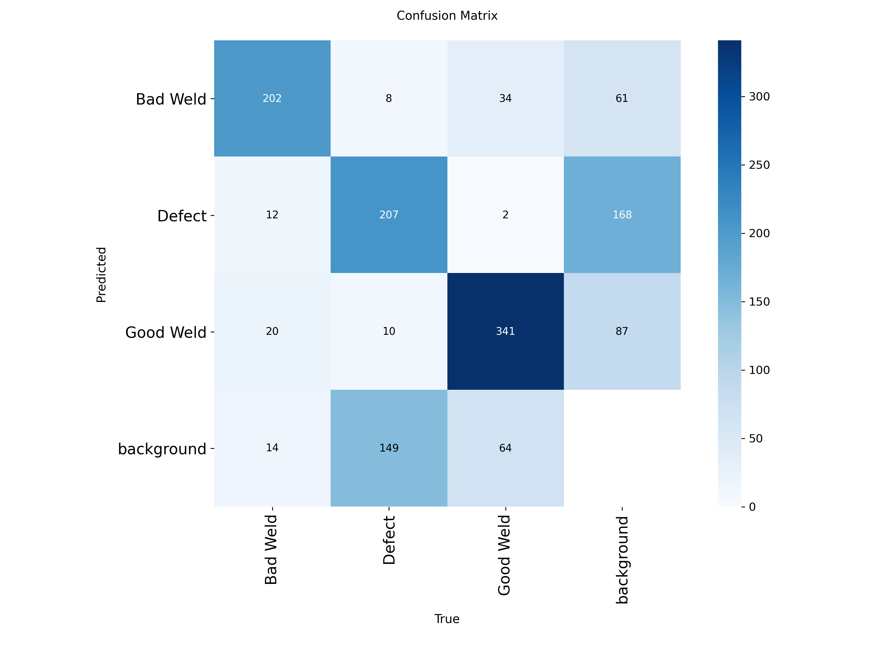

# Automated Vision-Based Defect Detection in Arc Welding

**Author:** DEV SHARMA

## Objective
This project implements an Automated Optical Inspection (AOI) pipeline using computer vision to detect and classify surface defects in arc welding. Designed to replace subjective manual inspection, the system identifies anomalies such as spatter, porosity, and undercuts using a custom-trained YOLOv8 architecture.

## Methodology
* **Environment:** Google Colab (Tesla T4 GPU)
* **Framework:** Ultralytics YOLOv8 (yolov8s architecture)
* **Dataset:** Open-source welding defect dataset sourced via Roboflow.
* **Process:** The model was trained over 150 epochs, optimizing for class-specific recall and overall mean Average Precision (mAP).

## Results & Performance
The upgraded `yolov8s` model achieved an overall **mAP50 of 74.5%** and demonstrated highly efficient inference speeds of **5.0ms per image (~200 FPS)**, making it highly viable for real-time manufacturing deployment.

### Defect Localization
*(The model successfully isolating weld defects)*

### Performance Metrics
*(Confusion Matrix demonstrating classification accuracy)*

## Repository Contents
* `ManTechProject.ipynb`: The complete Google Colab notebook containing data procurement, model initialization, training loops, and validation inference.
